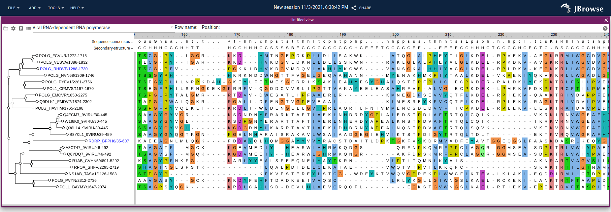

# jbrowse-plugin-msaview

This plugin packages https://github.com/gmod/react-msaview for usage inside of
JBrowse 2

See the docs for the react-msaview for more info
https://github.com/GMOD/react-msaview/blob/main/docs/user_guide.md

## Gallery



MSAView plugin running in JBrowse 2

## Demo

https://jbrowse.org/code/jb2/main/index.html?config=https://unpkg.com/jbrowse-plugin-msaview/dist/config.json&session=share-BVmmEYAoAv&password=SuQaN

## Features

- Vertical virtualized scrolling of phylogenetic tree
- Vertical and horizontal virtualized scrolling of multiple sequence alignment
- View metadata about alignment from MSA headers (e.g. stockholm)
- Collapse subtrees with click action on branches which also hides gaps that
  were introduced by that subtree in the rest of the alignment
- Allows "zooming out" by setting tiny rowHeight/colWidth settings
- Allows changing color schemes, with jalview, clustal, and other color schemes
- Allows toggling the branch length rendering for the phylogenetic tree
- Can share sessions with other users which will send relevant settings and
  links to files to automatically open your results
- The tree or the MSA panel can be loaded separately from each other

## File format supports

- FASTA formatted for MSA (e.g. gaps already inserted)
- Stockholm files (e.g. .stock file, with or without embedded newick tree, uses
  stockholm-js parser. also supports "multi-stockholm" files with multiple
  alignments embedded in a single file)
- Clustal files (e.g. .aln file, uses clustal-js parser)
- Newick (tree can be loaded separately as a .nh file)

## Data persistence

MSA datasets loaded from inline data (pasted text, local file uploads) are
automatically stored in the browser's IndexedDB to enable persistence across
page refreshes. This works around a limitation in react-msaview that strips
large data from session snapshots.

### How it works

1. When MSA data is loaded from inline sources (not URL-based files), it is
   automatically stored in IndexedDB
2. A reference ID (`dataStoreId`) is saved in the session snapshot instead of
   the raw data
3. On page reload, the plugin detects the `dataStoreId` and retrieves the data
   from IndexedDB
4. Old IndexedDB entries are automatically cleaned up after 7 days

Note: URL-based files (loaded via file selector with a URL) don't need IndexedDB
storage as they can be reloaded directly from the URL.

### Storage details

- Database name: `jbrowse-msaview-data`
- Stored data includes: MSA alignment, tree, and tree metadata
- Each entry is timestamped for cleanup purposes

This mechanism is transparent to users and requires no configuration.

## LaunchView-MsaView extension point

This plugin registers a `LaunchView-MsaView` extension point that allows
programmatic launching of an MsaView. This can be used via the JBrowse 2 session
spec URL parameters (see https://jbrowse.org/jb2/docs/urlparams/#session-spec).

### Parameters

| Parameter          | Required                    | Description                                     |
| ------------------ | --------------------------- | ----------------------------------------------- |
| `data`             | One of data/msaFileLocation | `{ msa: string, tree?: string }`                |
| `msaFileLocation`  | One of data/msaFileLocation | `{ uri: string }` for MSA file                  |
| `treeFileLocation` | No                          | `{ uri: string }` for tree file                 |
| `connectedViewId`  | No                          | ID of connected LinearGenomeView                |
| `connectedFeature` | No                          | Feature for cross-linking                       |
| `displayName`      | No                          | Custom view display name                        |
| `colorSchemeName`  | No                          | Color scheme (e.g., 'percent_identity_dynamic') |
| `colWidth`         | No                          | Column width in pixels                          |
| `rowHeight`        | No                          | Row height in pixels                            |
| `treeAreaWidth`    | No                          | Tree area width                                 |
| `treeWidth`        | No                          | Tree width                                      |
| `drawNodeBubbles`  | No                          | Show node bubbles on tree                       |
| `labelsAlignRight` | No                          | Align labels to the right                       |
| `showBranchLen`    | No                          | Show branch lengths                             |
| `querySeqName`     | No                          | Name for query sequence                         |

### URL example

```
https://jbrowse.org/code/jb2/main/?config=config.json&session=spec-{"views":[{"type":"MsaView","msaFileLocation":{"uri":"https://example.com/alignment.fa"}}]}
```

### Programmatic usage

```typescript
pluginManager.evaluateExtensionPoint('LaunchView-MsaView', {
  session,
  data: { msa: clustalOutput, tree: newickTree },
  displayName: 'My MSA',
  colorSchemeName: 'percent_identity_dynamic',
})
```

## Inter-plugin communication

This plugin supports bidirectional communication with both the Linear Genome
View and jbrowse-plugin-protein3d for synchronized highlighting and navigation.

### Communication with Linear Genome View

The MSA view can be connected to a Linear Genome View to enable cross-linking
between MSA columns and genome coordinates.

#### Connection mechanism

When launching an MSA view from a gene feature (via right-click context menu),
the plugin stores:

- `connectedViewId`: The ID of the Linear Genome View
- `connectedFeature`: The gene/transcript feature for coordinate mapping

#### Coordinate mapping

The plugin uses the `transcriptToMsaMap` (generated by g2p_mapper) to convert
between MSA positions and genome coordinates:

1. MSA column (gapped) → ungapped position
2. Ungapped position → protein position
3. Protein position → genome coordinate (via p2g mapping)

Key files:

- `src/MsaViewPanel/msaCoordToGenomeCoord.ts` - MSA to genome conversion
- `src/MsaViewPanel/genomeToMSA.ts` - Genome to MSA conversion

#### Click navigation

Clicking on an MSA column navigates the connected Linear Genome View to the
corresponding genome position. The `handleMsaClick()` action in
`src/MsaViewPanel/model.ts:364-382` handles this.

#### Bidirectional highlighting

- **MSA → Genome**: When hovering over MSA columns, the corresponding genome
  region is highlighted in the Linear Genome View via the
  `LinearGenomeView-TracksContainerComponent` extension point
  (`src/AddHighlightModel/MsaToGenomeHighlight.tsx`)

- **Genome → MSA**: When hovering over the genome view, the corresponding MSA
  column is highlighted (`src/AddHighlightModel/GenomeMouseoverHighlight.tsx`)

### Communication with jbrowse-plugin-protein3d

The MSA view can connect to protein structures displayed in
jbrowse-plugin-protein3d for synchronized highlighting between sequence
alignment and 3D structure.

#### Auto-connection

The plugin automatically discovers and connects to compatible ProteinViews based
on:

1. Matching `connectedViewId` (both views connected to the same genome view)
2. Matching `uniprotId` between MSA row and protein structure

This logic is in `src/MsaViewPanel/model.ts:625-685`.

#### Manual connection

Users can manually connect to protein structures via the menu: **Menu → "Connect
to protein structure..."**

The `ConnectStructureDialog`
(`src/MsaViewPanel/components/ConnectStructureDialog.tsx`) allows selecting:

- Which ProteinView to connect to
- Which structure (if multiple)
- Which MSA row to align with the structure sequence

#### Pairwise alignment

When connecting to a structure, the plugin performs a Needleman-Wunsch pairwise
alignment between the MSA row sequence and the structure's sequence to create
coordinate mappings. This handles cases where sequences may differ slightly.

Key file: `src/MsaViewPanel/pairwiseAlignment.ts`

#### Connection data structure

Each structure connection stores:

```typescript
interface StructureConnection {
  proteinViewId: string
  structureIdx: number
  msaRowName: string
  msaToStructure: Record<number, number> // MSA ungapped → structure position
  structureToMsa: Record<number, number> // structure position → MSA ungapped
}
```

#### Bidirectional highlighting

- **MSA → Structure**: When hovering over MSA columns, the corresponding residue
  is highlighted in the 3D structure via `structure.highlightFromExternal()`

- **Structure → MSA**: When hovering over residues in the 3D structure, the
  corresponding MSA column is highlighted. This works via two mechanisms:
  1. Direct mapping via `structureHoverCol` getter (requires explicit
     connection)
  2. Indirect via genome coordinates: the MSA view observes protein3d's
     `hoverGenomeHighlights` and maps back to MSA columns using `g2p` mapping.
     This works automatically when both views share the same `connectedViewId`.

### Three-way synchronization

When all three views are connected (Linear Genome View, MSA View, and Protein
View), hovering over any one view will highlight the corresponding positions in
the other two views, creating a fully synchronized visualization experience.

```
┌─────────────────────┐
│  Linear Genome View │◄────────────────────────────┐
│    (genome coords)  │                             │
└─────────┬───────────┘                             │
          │                                         │
          │ connectedViewId + connectedFeature      │ hoverGenomeHighlights
          │ (uses p2g/g2p mapping)                  │ (genome coords)
          ▼                                         │
┌─────────────────────┐                   ┌─────────┴───────────┐
│      MSA View       │◄──────────────────│    Protein View     │
│   (aligned seqs)    │  observes genome  │   (3D structure)    │
└─────────┬───────────┘  highlights       └───────────────────────┘
          │                                         ▲
          │ pairwise alignment mapping              │
          │ (msaToStructure/structureToMsa)         │
          └─────────────────────────────────────────┘
```

The MSA view can receive highlights from protein3d via two paths:

1. **Direct**: MSA observes `structure.hoverPosition` (requires explicit
   connection with matching `uniprotId`)
2. **Indirect**: MSA observes `structure.hoverGenomeHighlights` and maps genome
   coords back to MSA columns (works when both share `connectedViewId`)

### Launch mechanisms

The MSA view can be launched from the Linear Genome View via right-click context
menu on gene/mRNA/transcript features. This provides several data source
options:

1. **NCBI BLAST Query**: Submit protein sequence to NCBI BLAST and display
   results
2. **Pre-loaded MSA Datasets**: Use pre-calculated alignments from configuration
3. **Ensembl Gene Tree**: Fetch orthologous sequences from Ensembl
4. **Manual MSA Loader**: Load MSA/tree files directly

Each launch method automatically sets up the genome view connection for
coordinate mapping and highlighting.
