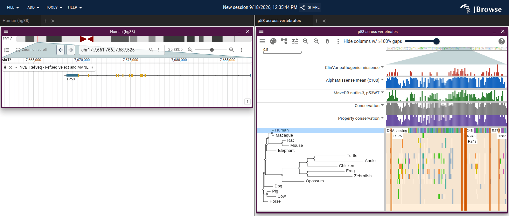

# jbrowse-plugin-msaview

A multiple sequence alignment and phylogenetic tree viewer for JBrowse 2, linked
column by column to the genome. It packages
[react-msaview](https://github.com/GMOD/react-msaview), whose
[user guide](https://github.com/GMOD/react-msaview/blob/main/docs/user_guide.md)
covers the viewer itself.

## Gallery

The [demo](#demo) below: TP53 in the genome view beside a vertebrate p53
alignment carrying per-residue variant tracks. Each release recaptures it with
`pnpm readme-figure`.

## Demo

[p53 across vertebrates, linked to the genome and the structure](https://jbrowse.org/code/jb2/main/?config=https://jbrowse.org/ucsc/hg38/config.json&session=spec-{%22views%22:[{%22type%22:%22LinearGenomeView%22,%22id%22:%22lgv1%22,%22assembly%22:%22hg38%22,%22loc%22:%22chr17:7,661,779-7,687,538%22,%22tracks%22:[%22hg38-ncbiRefSeqSelect%22]},{%22type%22:%22MsaView%22,%22displayName%22:%22p53%20across%20vertebrates%22,%22msa%22:%22https://gmod.org/JBrowseMSA/demo/data/p53/p53-vertebrates.afa%22,%22tree%22:%22https://gmod.org/JBrowseMSA/demo/data/p53/p53-vertebrates.nh%22,%22query%22:%22Human%22,%22connectedViewId%22:%22lgv1%22,%22connectedTranscript%22:%22NM_000546.6%22,%22placement%22:%22splitRight%22,%22colorSchemeName%22:%22clustalx_protein_dynamic%22,%22highlights%22:[{%22start%22:102,%22end%22:292,%22label%22:%22DNA-binding%22,%22color%22:%22rgba%28255,140,0,0.15%29%22},175,245,248,249,273,282],%22region%22:%22170-290%22,%22columnTracks%22:[{%22name%22:%22ClinVar%20pathogenic%20missense%22,%22color%22:%22%23c0392b%22,%22max%22:8,%22start%22:105,%22values%22:[2,1,0,0,2,4,3,0,6,0,0,0,0,0,0,0,0,0,0,1,2,1,5,0,0,2,2,3,1,1,4,0,0,2,0,0,2,0,3,0,0,0,1,0,0,0,6,2,0,0,1,1,3,6,2,0,1,0,2,1,1,0,0,2,0,0,2,1,3,0,3,3,1,3,5,1,3,0,0,0,0,0,0,0,0,1,0,0,4,3,1,1,1,0,1,0,0,0,0,0,3,0,0,0,0,0,0,0,3,2,1,1,0,1,0,3,0,0,0,0,0,0,0,0,0,0,0,3,0,4,0,2,4,6,2,3,5,2,0,4,5,4,1,6,2,1,2,0,1,3,0,0,0,2,1,0,0,0,0,0,2,3,3,0,1,4,1,3,6,0,2,1,1,3,0,3,8,3,1,0,2,2,0,0,0,0,0,0,0,0,0,1,0,0,0,0,0,0,0,0,0,0,0,0,0,0,0,0,0,0,0,0,0,0,0,0,0,0,0,0,0,1,0,0,0,0,0,1,0,1,0,0,5,0,0,0,1,1,0,2,0,0,1]},{%22name%22:%22AlphaMissense%20mean%20%28x100%29%22,%22color%22:%22%231565c0%22,%22max%22:100,%22values%22:[49,27,19,11,12,14,18,10,12,14,28,17,40,57,73,65,65,68,95,29,30,72,95,21,24,60,39,21,18,17,18,16,17,12,11,13,14,13,14,21,22,20,17,20,16,16,15,14,17,17,15,13,37,29,11,19,16,11,11,12,14,20,14,12,11,20,13,19,15,14,12,13,15,17,14,17,15,19,20,17,15,15,22,22,19,22,20,24,17,23,67,41,46,66,63,37,90,98,63,35,36,20,76,15,99,13,58,48,98,26,81,57,97,43,17,64,87,68,90,98,96,92,73,81,98,91,95,23,13,81,56,97,84,97,98,87,86,81,91,84,94,93,89,66,81,57,77,26,20,13,90,69,17,52,70,49,91,98,87,88,94,87,95,89,48,54,52,76,76,68,92,87,98,78,99,100,98,97,100,96,85,50,38,52,32,74,52,32,83,87,71,47,99,95,89,95,91,96,95,81,20,25,69,48,98,24,64,93,17,23,84,56,99,92,91,93,70,89,76,91,77,27,92,87,57,92,58,35,54,68,75,87,85,87,74,93,96,100,95,98,99,100,94,100,100,98,97,100,99,93,93,59,91,91,87,92,93,99,87,22,21,94,24,76,83,99,98,36,61,97,93,93,99,95,100,97,100,100,99,100,100,97,84,60,98,96,47,62,13,18,56,34,17,17,11,9,9,16,11,15,13,18,20,17,81,75,26,26,23,13,12,14,16,18,18,14,15,15,47,54,46,19,13,34,24,50,56,88,36,87,48,93,63,98,73,40,89,90,45,60,88,51,36,81,77,55,79,75,87,31,54,67,23,18,17,16,25,22,13,15,15,16,20,18,15,20,25,13,15,56,21,47,45,21,16,16,15,21,16,20,66,47,13,26,19,66,13,28,18,16,47,54,66]},{%22name%22:%22MaveDB%20nutlin-3,%20p53WT%22,%22color%22:%22%232e7d32%22,%22max%22:2,%22start%22:27,%22values%22:[0.6,0,0.1,0,0,0,0,0,0,0,0,0,0,0,0,0,0,0,0,0,0,0,0,0,0,0,0,0,0,0,0,0,0,0,0,0,0,0,0,0,0,0,0,0,0,0,0,0,0,0,0,0,0,0,0,0,0,0,0,0,0,0,0,0,0,0,0,0.1,0,0,0.2,0.4,0,0,0,0,0.1,0,0.8,0,0.7,0.3,1.6,0.1,1.4,0.1,1.3,0,0,0,0.1,0,0.1,0.5,0.2,0.4,0.4,0.8,0.8,1.4,1.5,0.1,0.1,1.2,1,1.7,1.1,1.4,1.3,0.8,0.5,0.5,0.8,0.4,1.2,0.4,1.4,0.7,1.2,0.6,1.1,0.5,0.4,0.6,1.5,1.3,0,0.7,1.3,0.3,1.4,1,1.4,0.8,1.4,0.8,1.8,0.8,0.3,0,0.2,0.8,0.4,0,0.6,0.7,1.7,1,1.2,2,1.1,0.6,2,0.8,0.7,0.3,0.1,0.4,0.2,0.3,0.1,0.1,0.5,0.8,0.1,0.1,1.4,1.6,1.4,0.7,1.3,0.1,0.1,0,0,0,0.9,0.3,1.8,0,0,1,0,0.1,0.9,0.7,1.2,1.1,1.5,1.4,0.6,1.3,0.5,1.5,0.4,0.3,0.6,0.3,0.1,0.4,0.3,0.2,0.7,0.5,0.6,1.4,0.5,1.4,0.6,1.7,1.1,1.9,0.8,1.3,1.3,1.7,0.9,1.7,2.2,2,0.9,1.5,2.1,1,1.4,0.3,1.3,1.2,1.4,0.8,1.4,1.4,0.9,0.5,0.5,0.7,0.5,0.5,0.8,1.6,1,0.9,0.8,1.5,1.3,1.5,1.5,1.7,1.8,0.5,0.4,2,0,0.9,0.6,1,0,0,1,1.8,0,0.1,0.2,0.1,0.2,0,0.1,0.4,0.4,0.3,0.4,0.6,0.4,0.6,0.5]}]},{%22type%22:%22ProteinView%22,%22uniprotId%22:%22P04637%22,%22transcriptId%22:%22NM_000546.6%22,%22connectedViewId%22:%22lgv1%22,%22connectedView%22:{%22assembly%22:%22hg38%22,%22loc%22:%22chr17:7,661,779-7,687,538%22,%22tracks%22:[%22hg38-ncbiRefSeqSelect%22]}}]}):
TP53 in hg38, a vertebrate p53 alignment carrying ClinVar, AlphaMissense and
MaveDB per-residue tracks, and the AlphaFold model of P04637. Hovering a codon,
a column or a residue lights the other two views.
[Launching](docs/launching.md#the-readme-demo-taken-apart) takes the link apart.

An older shared session:
https://jbrowse.org/code/jb2/main/index.html?config=https://unpkg.com/jbrowse-plugin-msaview/dist/config.json&session=share-BVmmEYAoAv&password=SuQaN

## Features

- Vertical virtualized scrolling of phylogenetic tree
- Vertical and horizontal virtualized scrolling of multiple sequence alignment
- View metadata about alignment from MSA headers (e.g. stockholm)
- Collapse subtrees with click action on branches which also hides gaps that
  were introduced by that subtree in the rest of the alignment
- Allows "zooming out" by setting tiny rowHeight/colWidth settings
- Allows changing color schemes, with jalview, clustal, and other color schemes
- Allows toggling the branch length rendering for the phylogenetic tree
- Can share sessions with other users which will send relevant settings and
  links to files to automatically open your results
- The tree or the MSA panel can be loaded separately from each other
- Builds a cross-species alignment for any gene from the genome view's
  right-click menu: precomputed orthologs (NCBI, PANTHER), the gene's UniRef
  cluster across all of UniProtKB, or a phmmer/blastp search at EBI
- Aligns and builds trees in the browser, so a UniRef launch needs no job at any
  external service; EBI's aligners remain an option
- Every launch is also a session-spec URL (`orthologParams`, `searchParams`,
  `connectedTranscript`), see [launching](docs/launching.md)

## File format supports

- FASTA formatted for MSA (e.g. gaps already inserted)
- Stockholm files (e.g. .stock file, with or without embedded newick tree, uses
  stockholm-js parser. also supports "multi-stockholm" files with multiple
  alignments embedded in a single file)
- Clustal files (e.g. .aln file, uses clustal-js parser)
- Newick (tree can be loaded separately as a .nh file)

## Availability

This plugin is installed by default on https://genomes.jbrowse.org so you can
use it on any species there

## Documentation

Using the plugin:

- [Alignments from a gene](docs/alignments-from-a-gene.md): the launch dialog's
  sources — NCBI, PANTHER and UniRef orthologs, EBI searches — and aligning in
  the browser.
- [Your own alignments](docs/your-own-alignments.md): opening an alignment you
  made, from a file, a link, or a per-gene dataset a site configures.
- [BLAST](docs/blast.md): why searches run at EBI rather than NCBI, and the
  manual route to NCBI's `nr`.

Linking and embedding:

- [Launching from a URL or code](docs/launching.md): worked session-spec links,
  the genome connection, highlights, opening on a residue, and placement.
- [Launch parameters](docs/launch-parameters.md): every argument and field.
- [Linked views](docs/linked-views.md): how a column reaches its codon and a
  protein3d structure.

Working on the plugin:

- [DEVELOPERS.md](DEVELOPERS.md): running it locally, the checks, the README
  figure and publishing.

## Publication

If you find this tool useful please cite our work

Diesh, C., Stevens, G., Bridge, C., Hogue, G., Buels, R., Cain, S., Stein, L., &
Holmes, I. (2026). Proteins in the Genome Browser: Integration of Phylogenies,
Alignments, and Structures With Nucleotide-level Evidence in JBrowse 2. Journal
of Molecular Biology, 169645. https://doi.org/10.1016/j.jmb.2026.169645

See also https://github.com/GMOD/proteinbrowser for overview
